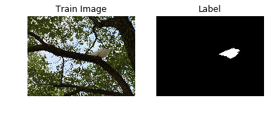
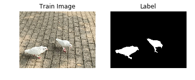
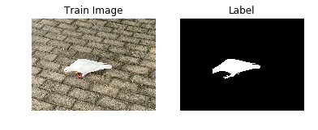
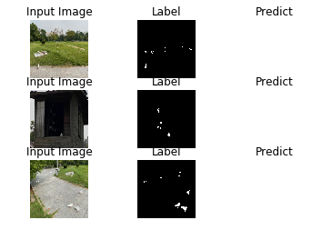
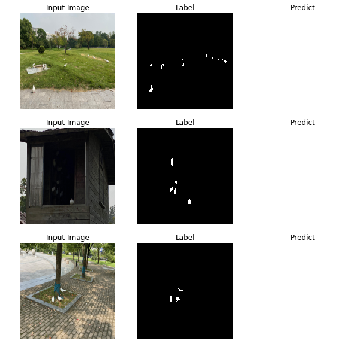

# 1. 项目简介
本项目介绍如何从零开始完成一个图像分割任务。通过自建数据集，并分别使用基于Paddle2.0和PaddleSeg2.0的方法完成图像分割任务。

## 1.1 什么是图像分割
图像分割是一种典型的计算机视觉任务，指的是将一张图像分割成既定类别的几个区域。图像分割本质上是一种像素级别的图像分类任务。

图像分割通常分为语义分割、实例分割、全景分割，如图1所示。另外，还有基于视频的目标分割和实例分割。本项目中我们将完成一个图像语义分割任务。

<div style="text-align: center">

  <p style="margin-top: 20px">图1 图像分割任务示意图</p>
</div>


# 2. 创建数据集
本项目采用自建的鸽子图片数据集。创建数据集分为如下几步：
## 2.1. 拍摄鸽子的照片。
拍摄鸽子图片时尽量选择不同角度、不同背景进行拍摄，图片中的鸽子数量也尽量不同，以便增加图片的多样性从而提高最后模型的鲁棒性。由于本项目只是讲述流程，故这里仅采用了124张照片。

## 2.2. 使用labelme进行标注。
严格按照labelme github仓库主页的描述来安装labelme，链接为[labelme github网址](https://github.com/wkentaro/labelme)

## 2.3. 基于标注好的图片利用json文件生成原始图片和标签图片。
使用labelme完成标注任务后，需要利用保存的json文件来生成原始图片和对应的标签图片。这里要注意的是，由于labelme自带的labelme_json_to_dataset命令只能处理单个json文件，如果要批量处理所有生成的json文件可以采用并修改如下示例代码：
```
import os
path = PATH_TO_JSON
json_file = os.listdir(path)
#os.system("conda activate labelme")
for file in json_file:
    os.system("labelme_json_to_dataset %s"%(path+"/"+file))
```
## 2.4. 使用AI Studio创建并上传标注好的图片。
通常生成的数据集较大，这时可以使用AI Studio的创建数据集功能上传生成的数据，然后在项目中挂载使用。

完成以上步骤后就可以使用AI Studio进行训练、验证和预测了。

# 3. 训练、验证和预测
下面以U-Net网络为例，讲述两种进行训练、验证和预测的方法：基于Paddle2.0 API的方法和基于PaddleSeg2.0的方法。

## 3.1 基于Paddle2.0 API使用U-Net网络实现鸽子图像的语义分割任务

这部分借鉴了项目[『跟着雨哥学AI』系列06：趣味案例——基于U-Net的宠物图像分割](https://aistudio.baidu.com/aistudio/projectdetail/1246330) 
的部分内容。

### 3.1.1 简要介绍
U-Net网络结构是一个基于FCN并改进后的深度学习网络，包含下采样（编码器，特征提取）和上采样（解码器，分辨率还原）两个阶段，因模型结构比较像U型而命名为U-Net。

### 3.1.2.环境设置

导入一些比较基础常用的模块，确认自己的飞桨版本。


```python
import os
import io
import numpy as np
import matplotlib.pyplot as plt
from PIL import Image as PilImage

import paddle
from paddle.nn import functional as F

import warnings
warnings.filterwarnings('ignore') 

paddle.__version__
```


    '2.2.2'


### 3.1.3 解压数据集


```python
!unzip -oq /home/aistudio/data/data75217/doves.zip -d work/doves
```

### 3.1.4 数据集概览

首先我们先来了解一下我们的数据集。

数据集解压后，里面放的每个文件夹中有四个文件，分别是图片文件、标签文件、标签名字文件和可视化的图片文件，如下所示。

```bash
.
├── label.png
├── img.png
├── label_names.txt
└── label_viz.png
```

我们来看看这个数据集给我们提供了多少个训练样本。


```python
images_path = "work/doves"
image_count = len([os.path.join(images_path, image_name) 
          for image_name in os.listdir(images_path)])
print("用于训练的图片样本数量:", image_count)
```

    用于训练的图片样本数量: 124


### 3.1.5 划分训练集、验证集和测试集


```python
def _sort_images(image_dir):
    """
    对文件夹内的图像进行按照文件名排序
    """
    images = []
    labels = []

    for image_name in os.listdir(image_dir):
        if os.path.isdir(os.path.join(image_dir, image_name)):
            images.append(os.path.join(os.path.join(image_dir, image_name), 'img.png'))
            labels.append(os.path.join(os.path.join(image_dir, image_name), 'label.png'))

    return sorted(images), sorted(labels)
"""
这里的分割符是\t，后面使用PaddleSeg的时候要注意修改相关代码，因为PaddleSeg读取文件时默认的分割符是空格。
当然也可以将这里的\t替换为空格。
"""
def write_file(mode, images, labels):
    with open('./{}.txt'.format(mode), 'w') as f:
        for i in range(len(images)):
            f.write('{}\t{}\n'.format(images[i], labels[i]))
    
"""
由于所有文件都是散落在文件夹中，在训练时我们需要使用的是数据集和标签对应的数据关系，
所以我们第一步是对原始的数据集进行整理，得到数据集和标签两个数组，分别一一对应。
这样可以在使用的时候能够很方便的找到原始数据和标签的对应关系，否则对于原有的文件夹图片数据无法直接应用。
"""
images, labels = _sort_images(images_path)
eval_num = int(image_count * 0.15)

"""
由于图片数量有限，这里的测试集和验证集采用相同的一组图片。
"""
write_file('train', images[:-eval_num], labels[:-eval_num])
write_file('test', images[-eval_num:], labels[-eval_num:])
write_file('eval', images[-eval_num:], labels[-eval_num:])
```

### 3.1.6 DoveDataSet数据集抽样展示

划分好数据集之后，我们来查验一下数据集是否符合预期，我们通过划分的配置文件读取图片路径后再加载图片数据来用matplotlib进行展示，这里要注意的是对于分割的标签文件因为是1通道的灰度图片，需要在使用imshow接口时注意下传参cmap='gray'。


```python
with open('./train.txt', 'r') as f:
    i = 0

    for line in f.readlines():
        image_path, label_path = line.strip().split('\t')
        image = np.array(PilImage.open(image_path))
        label = np.array(PilImage.open(label_path))
    
        if i > 2:
            break
        # 进行图片的展示
        plt.figure()

        plt.subplot(1,2,1), 
        plt.title('Train Image')
        plt.imshow(image.astype('uint8'))
        plt.axis('off')

        plt.subplot(1,2,2), 
        plt.title('Label')
        plt.imshow(label.astype('uint8'), cmap='gray')
        plt.axis('off')

        plt.show()
        i = i + 1
```











### 3.1.7 数据集类定义

飞桨（PaddlePaddle）数据集加载方案是统一使用Dataset（数据集定义） + DataLoader（多进程数据集加载）。

首先我们先进行数据集的定义，数据集定义主要是实现一个新的Dataset类，继承父类paddle.io.Dataset，并实现父类中以下两个抽象方法，`__getitem__`和`__len__`：

```python
class MyDataset(Dataset):
    def __init__(self):
        ...
        
    # 每次迭代时返回数据和对应的标签
    def __getitem__(self, idx):
        return x, y

    # 返回整个数据集的总数
    def __len__(self):
        return count(samples)
```

在数据集内部可以结合图像数据预处理相关API进行图像的预处理（改变大小、反转、调整格式等）。

由于加载进来的图像不一定都符合自己的需求，举个例子，已下载的这些图片里面就会有RGBA格式的图片，这个时候图片就不符合我们所需3通道的需求，我们需要进行图片的格式转换，那么这里我们直接实现了一个通用的图片读取接口，确保读取出来的图片都是满足我们的需求。

另外图片加载出来的默认shape是HWC，这个时候要看看是否满足后面训练的需要，如果Layer的默认格式和这个不是符合的情况下，需要看下Layer有没有参数可以进行格式调整。不过如果layer较多的话，还是直接调整原数据Shape比较好，否则每个layer都要做参数设置，如果有遗漏就会导致训练出错，那么在本案例中是直接对数据源的shape做了统一调整，从HWC转换成了CHW，因为飞桨的卷积等API的默认输入格式为CHW，这样处理方便后续模型训练。

本项目的数据集定义的代码可以参考code目录下的dove_dataset.py文件。

### 3.1.8 模型组网

U-Net是一个U型网络结构，可以看做两个大的阶段，图像先经过Encoder编码器进行下采样得到高级语义特征图，再经过Decoder解码器上采样将特征图恢复到原图片的分辨率。

具体的网络定义的代码可以参考code目录下的unet.py文件,具体网络结构包括如下几部分。

### 3.1.9 定义SeparableConv2D接口

我们为了减少卷积操作中的训练参数来提升性能，是继承paddle.nn.Layer自定义了一个SeparableConv2D Layer类，整个过程是把`filter_size * filter_size * num_filters`的Conv2D操作拆解为两个子Conv2D，先对输入数据的每个通道使用`filter_size * filter_size * 1`的卷积核进行计算，输入输出通道数目相同，之后在使用`1 * 1 * num_filters`的卷积核计算。

### 3.1.10 定义Encoder编码器

我们将网络结构中的Encoder下采样过程进行了一个Layer封装，方便后续调用，减少代码编写，下采样是有一个模型逐渐向下画曲线的一个过程，这个过程中是不断的重复一个单元结构将通道数不断增加，形状不断缩小，并且引入残差网络结构，我们将这些都抽象出来进行统一封装。

### 3.1.11 定义Decoder解码器

在通道数达到最大得到高级语义特征图后，网络结构会开始进行decode操作，进行上采样，通道数逐渐减小，对应图片尺寸逐步增加，直至恢复到原图像大小，那么这个过程里面也是通过不断的重复相同结构的残差网络完成，我们也是为了减少代码编写，将这个过程定义一个Layer来放到模型组网中使用。

### 3.1.12 训练模型组网

按照U型网络结构格式进行整体的网络结构搭建，三次下采样，四次上采样。

### 3.1.13 模型可视化

调用飞桨提供的summary接口对组建好的模型进行可视化，方便进行模型结构和参数信息的查看和确认。


```python
import paddle
from codee.unet import DoveNet

num_classes = 2
IMAGE_SIZE = (224, 224)
network = DoveNet(num_classes)
model = paddle.Model(network)
model.summary((-1, 3,) + IMAGE_SIZE)
```

    -----------------------------------------------------------------------------
      Layer (type)        Input Shape          Output Shape         Param #    
    =============================================================================
        Conv2D-1       [[1, 3, 224, 224]]   [1, 32, 112, 112]         896      
      BatchNorm2D-1   [[1, 32, 112, 112]]   [1, 32, 112, 112]         128      
         ReLU-1       [[1, 32, 112, 112]]   [1, 32, 112, 112]          0       
         ReLU-2       [[1, 32, 112, 112]]   [1, 32, 112, 112]          0       
    SeparableConv2D-1 [[1, 32, 112, 112]]   [1, 64, 112, 112]        2,400     
      BatchNorm2D-2   [[1, 64, 112, 112]]   [1, 64, 112, 112]         256      
         ReLU-3       [[1, 64, 112, 112]]   [1, 64, 112, 112]          0       
    SeparableConv2D-2 [[1, 64, 112, 112]]   [1, 64, 112, 112]        4,736     
      BatchNorm2D-3   [[1, 64, 112, 112]]   [1, 64, 112, 112]         256      
       MaxPool2D-1    [[1, 64, 112, 112]]    [1, 64, 56, 56]           0       
        Conv2D-2      [[1, 32, 112, 112]]    [1, 64, 56, 56]         2,112     
        Encoder-1     [[1, 32, 112, 112]]    [1, 64, 56, 56]           0       
         ReLU-4        [[1, 64, 56, 56]]     [1, 64, 56, 56]           0       
    SeparableConv2D-3  [[1, 64, 56, 56]]     [1, 128, 56, 56]        8,896     
      BatchNorm2D-4    [[1, 128, 56, 56]]    [1, 128, 56, 56]         512      
         ReLU-5        [[1, 128, 56, 56]]    [1, 128, 56, 56]          0       
    SeparableConv2D-4  [[1, 128, 56, 56]]    [1, 128, 56, 56]       17,664     
      BatchNorm2D-5    [[1, 128, 56, 56]]    [1, 128, 56, 56]         512      
       MaxPool2D-2     [[1, 128, 56, 56]]    [1, 128, 28, 28]          0       
        Conv2D-3       [[1, 64, 56, 56]]     [1, 128, 28, 28]        8,320     
        Encoder-2      [[1, 64, 56, 56]]     [1, 128, 28, 28]          0       
         ReLU-6        [[1, 128, 28, 28]]    [1, 128, 28, 28]          0       
    SeparableConv2D-5  [[1, 128, 28, 28]]    [1, 256, 28, 28]       34,176     
      BatchNorm2D-6    [[1, 256, 28, 28]]    [1, 256, 28, 28]        1,024     
         ReLU-7        [[1, 256, 28, 28]]    [1, 256, 28, 28]          0       
    SeparableConv2D-6  [[1, 256, 28, 28]]    [1, 256, 28, 28]       68,096     
      BatchNorm2D-7    [[1, 256, 28, 28]]    [1, 256, 28, 28]        1,024     
       MaxPool2D-3     [[1, 256, 28, 28]]    [1, 256, 14, 14]          0       
        Conv2D-4       [[1, 128, 28, 28]]    [1, 256, 14, 14]       33,024     
        Encoder-3      [[1, 128, 28, 28]]    [1, 256, 14, 14]          0       
         ReLU-8        [[1, 256, 14, 14]]    [1, 256, 14, 14]          0       
    Conv2DTranspose-1  [[1, 256, 14, 14]]    [1, 256, 14, 14]       590,080    
      BatchNorm2D-8    [[1, 256, 14, 14]]    [1, 256, 14, 14]        1,024     
         ReLU-9        [[1, 256, 14, 14]]    [1, 256, 14, 14]          0       
    Conv2DTranspose-2  [[1, 256, 14, 14]]    [1, 256, 14, 14]       590,080    
      BatchNorm2D-9    [[1, 256, 14, 14]]    [1, 256, 14, 14]        1,024     
       Upsample-1      [[1, 256, 14, 14]]    [1, 256, 28, 28]          0       
       Upsample-2      [[1, 256, 14, 14]]    [1, 256, 28, 28]          0       
        Conv2D-5       [[1, 256, 28, 28]]    [1, 256, 28, 28]       65,792     
        Decoder-1      [[1, 256, 14, 14]]    [1, 256, 28, 28]          0       
         ReLU-10       [[1, 256, 28, 28]]    [1, 256, 28, 28]          0       
    Conv2DTranspose-3  [[1, 256, 28, 28]]    [1, 128, 28, 28]       295,040    
     BatchNorm2D-10    [[1, 128, 28, 28]]    [1, 128, 28, 28]         512      
         ReLU-11       [[1, 128, 28, 28]]    [1, 128, 28, 28]          0       
    Conv2DTranspose-4  [[1, 128, 28, 28]]    [1, 128, 28, 28]       147,584    
     BatchNorm2D-11    [[1, 128, 28, 28]]    [1, 128, 28, 28]         512      
       Upsample-3      [[1, 128, 28, 28]]    [1, 128, 56, 56]          0       
       Upsample-4      [[1, 256, 28, 28]]    [1, 256, 56, 56]          0       
        Conv2D-6       [[1, 256, 56, 56]]    [1, 128, 56, 56]       32,896     
        Decoder-2      [[1, 256, 28, 28]]    [1, 128, 56, 56]          0       
         ReLU-12       [[1, 128, 56, 56]]    [1, 128, 56, 56]          0       
    Conv2DTranspose-5  [[1, 128, 56, 56]]    [1, 64, 56, 56]        73,792     
     BatchNorm2D-12    [[1, 64, 56, 56]]     [1, 64, 56, 56]          256      
         ReLU-13       [[1, 64, 56, 56]]     [1, 64, 56, 56]           0       
    Conv2DTranspose-6  [[1, 64, 56, 56]]     [1, 64, 56, 56]        36,928     
     BatchNorm2D-13    [[1, 64, 56, 56]]     [1, 64, 56, 56]          256      
       Upsample-5      [[1, 64, 56, 56]]    [1, 64, 112, 112]          0       
       Upsample-6      [[1, 128, 56, 56]]   [1, 128, 112, 112]         0       
        Conv2D-7      [[1, 128, 112, 112]]  [1, 64, 112, 112]        8,256     
        Decoder-3      [[1, 128, 56, 56]]   [1, 64, 112, 112]          0       
         ReLU-14      [[1, 64, 112, 112]]   [1, 64, 112, 112]          0       
    Conv2DTranspose-7 [[1, 64, 112, 112]]   [1, 32, 112, 112]       18,464     
     BatchNorm2D-14   [[1, 32, 112, 112]]   [1, 32, 112, 112]         128      
         ReLU-15      [[1, 32, 112, 112]]   [1, 32, 112, 112]          0       
    Conv2DTranspose-8 [[1, 32, 112, 112]]   [1, 32, 112, 112]        9,248     
     BatchNorm2D-15   [[1, 32, 112, 112]]   [1, 32, 112, 112]         128      
       Upsample-7     [[1, 32, 112, 112]]   [1, 32, 224, 224]          0       
       Upsample-8     [[1, 64, 112, 112]]   [1, 64, 224, 224]          0       
        Conv2D-8      [[1, 64, 224, 224]]   [1, 32, 224, 224]        2,080     
        Decoder-4     [[1, 64, 112, 112]]   [1, 32, 224, 224]          0       
        Conv2D-9      [[1, 32, 224, 224]]    [1, 2, 224, 224]         578      
    =============================================================================
    Total params: 2,058,690
    Trainable params: 2,051,138
    Non-trainable params: 7,552
    -----------------------------------------------------------------------------
    Input size (MB): 0.57
    Forward/backward pass size (MB): 230.07
    Params size (MB): 7.85
    Estimated Total Size (MB): 238.50
    -----------------------------------------------------------------------------
    


    {'total_params': 2058690, 'trainable_params': 2051138}


### 3.1.14 启动模型训练

使用模型代码进行Model实例生成，使用prepare接口定义优化器、损失函数和评价指标等信息，用于后续训练使用。在所有初步配置完成后，调用fit接口开启训练执行过程，调用fit时只需要将前面定义好的训练数据集、测试数据集、训练轮次（Epoch）和批次大小（batch_size）配置好即可。


```python
!python codee/train.py
```

    /opt/conda/envs/python35-paddle120-env/lib/python3.7/site-packages/setuptools/depends.py:2: DeprecationWarning: the imp module is deprecated in favour of importlib; see the module's documentation for alternative uses
      import imp
    E0222 23:22:06.379097  5901 pybind.cc:1625] Cannot use GPU because you have installed CPU version PaddlePaddle.
    If you want to use GPU, please try to install GPU version PaddlePaddle by: pip install paddlepaddle-gpu
    If you only have CPU, please change CUDAPlace(0) to be CPUPlace().


### 3.1.15 预测数据集准备和预测

继续使用DoveDataset来实例化待预测使用的数据集。

我们可以直接使用model.predict接口来对数据集进行预测操作，只需要将预测数据集传递到接口内即可。


```python
import paddle
from codee.unet import DoveNet
from codee.dove_dataset import DoveDataset
```


```python
num_classes = 2
network = DoveNet(num_classes)
```

### 3.1.16 预测结果可视化

从我们的预测数据集中抽3个图片来看看预测的效果，展示一下原图、标签图和预测结果。


```python
import numpy as np
import matplotlib.pyplot as plt
from paddle.vision.transforms import transforms as T
from PIL import Image as PilImage
```


```python
# plt.figure(figsize=(10, 10))

IMAGE_SIZE = (224, 224)
i = 0
idx = 0

with open('./test.txt', 'r') as f:
    for line in f.readlines():
        image_path, label_path = line.strip().split('\t')
        resize_t = T.Compose([
            T.Resize(IMAGE_SIZE)
        ])
        image = resize_t(PilImage.open(image_path))
        label = resize_t(PilImage.open(label_path))

        image = np.array(image).astype('uint8')
        label = np.array(label).astype('uint8')

        if i > 8: 
            break
        plt.subplot(3, 3, i + 1)
        plt.imshow(image)
        plt.title('Input Image')
        plt.axis("off")

        plt.subplot(3, 3, i + 2)
        plt.imshow(label, cmap='gray')
        plt.title('Label')
        plt.axis("off")
        
        # data = predict_results[0][0][idx].transpose((1, 2, 0))
        # mask = np.argmax(data, axis=-1)

        plt.subplot(3, 3, i + 3)
        # plt.imshow(mask.astype('uint8'), cmap='gray')
        plt.title('Predict')
        plt.axis("off")
        i += 3
        idx += 1

plt.show()
```





## 3.2 基于PaddleSeg使用U-Net网络实现鸽子图像的语义分割任务

### 3.2.1 安装PaddleSeg


```python
!pip install paddleseg
```

    Looking in indexes: https://pypi.tuna.tsinghua.edu.cn/simple
    Collecting paddleseg
      Downloading https://pypi.tuna.tsinghua.edu.cn/packages/1b/5b/44c7fc5b5f030553ecf391bba0e484856f31860b24d7730d53c41aa2cc3d/paddleseg-2.4.0-py3-none-any.whl (275 kB)
         |████████████████████████████████| 275 kB 6.9 MB/s            
    [?25hRequirement already satisfied: sklearn in /opt/conda/envs/python35-paddle120-env/lib/python3.7/site-packages (from paddleseg) (0.0)
    Requirement already satisfied: flake8 in /opt/conda/envs/python35-paddle120-env/lib/python3.7/site-packages (from paddleseg) (4.0.1)
    Requirement already satisfied: filelock in /opt/conda/envs/python35-paddle120-env/lib/python3.7/site-packages (from paddleseg) (3.0.12)
    Requirement already satisfied: scipy in /opt/conda/envs/python35-paddle120-env/lib/python3.7/site-packages (from paddleseg) (1.3.0)
    Requirement already satisfied: opencv-python in /opt/conda/envs/python35-paddle120-env/lib/python3.7/site-packages (from paddleseg) (4.1.1.26)
    Requirement already satisfied: visualdl>=2.0.0 in /opt/conda/envs/python35-paddle120-env/lib/python3.7/site-packages (from paddleseg) (2.2.0)
    Requirement already satisfied: pre-commit in /opt/conda/envs/python35-paddle120-env/lib/python3.7/site-packages (from paddleseg) (1.21.0)
    Requirement already satisfied: pyyaml>=5.1 in /opt/conda/envs/python35-paddle120-env/lib/python3.7/site-packages (from paddleseg) (5.1.2)
    Requirement already satisfied: prettytable in /opt/conda/envs/python35-paddle120-env/lib/python3.7/site-packages (from paddleseg) (0.7.2)
    Requirement already satisfied: tqdm in /opt/conda/envs/python35-paddle120-env/lib/python3.7/site-packages (from paddleseg) (4.27.0)
    Requirement already satisfied: yapf==0.26.0 in /opt/conda/envs/python35-paddle120-env/lib/python3.7/site-packages (from paddleseg) (0.26.0)
    Requirement already satisfied: matplotlib in /opt/conda/envs/python35-paddle120-env/lib/python3.7/site-packages (from visualdl>=2.0.0->paddleseg) (2.2.3)
    Requirement already satisfied: bce-python-sdk in /opt/conda/envs/python35-paddle120-env/lib/python3.7/site-packages (from visualdl>=2.0.0->paddleseg) (0.8.53)
    Requirement already satisfied: six>=1.14.0 in /opt/conda/envs/python35-paddle120-env/lib/python3.7/site-packages (from visualdl>=2.0.0->paddleseg) (1.16.0)
    Requirement already satisfied: pandas in /opt/conda/envs/python35-paddle120-env/lib/python3.7/site-packages (from visualdl>=2.0.0->paddleseg) (1.1.5)
    Requirement already satisfied: flask>=1.1.1 in /opt/conda/envs/python35-paddle120-env/lib/python3.7/site-packages (from visualdl>=2.0.0->paddleseg) (1.1.1)
    Requirement already satisfied: protobuf>=3.11.0 in /opt/conda/envs/python35-paddle120-env/lib/python3.7/site-packages (from visualdl>=2.0.0->paddleseg) (3.14.0)
    Requirement already satisfied: shellcheck-py in /opt/conda/envs/python35-paddle120-env/lib/python3.7/site-packages (from visualdl>=2.0.0->paddleseg) (0.7.1.1)
    Requirement already satisfied: Pillow>=7.0.0 in /opt/conda/envs/python35-paddle120-env/lib/python3.7/site-packages (from visualdl>=2.0.0->paddleseg) (8.2.0)
    Requirement already satisfied: Flask-Babel>=1.0.0 in /opt/conda/envs/python35-paddle120-env/lib/python3.7/site-packages (from visualdl>=2.0.0->paddleseg) (1.0.0)
    Requirement already satisfied: requests in /opt/conda/envs/python35-paddle120-env/lib/python3.7/site-packages (from visualdl>=2.0.0->paddleseg) (2.24.0)
    Requirement already satisfied: numpy in /opt/conda/envs/python35-paddle120-env/lib/python3.7/site-packages (from visualdl>=2.0.0->paddleseg) (1.19.5)
    Requirement already satisfied: pyflakes<2.5.0,>=2.4.0 in /opt/conda/envs/python35-paddle120-env/lib/python3.7/site-packages (from flake8->paddleseg) (2.4.0)
    Requirement already satisfied: mccabe<0.7.0,>=0.6.0 in /opt/conda/envs/python35-paddle120-env/lib/python3.7/site-packages (from flake8->paddleseg) (0.6.1)
    Requirement already satisfied: pycodestyle<2.9.0,>=2.8.0 in /opt/conda/envs/python35-paddle120-env/lib/python3.7/site-packages (from flake8->paddleseg) (2.8.0)
    Requirement already satisfied: importlib-metadata<4.3 in /opt/conda/envs/python35-paddle120-env/lib/python3.7/site-packages (from flake8->paddleseg) (4.2.0)
    Requirement already satisfied: identify>=1.0.0 in /opt/conda/envs/python35-paddle120-env/lib/python3.7/site-packages (from pre-commit->paddleseg) (1.4.10)
    Requirement already satisfied: nodeenv>=0.11.1 in /opt/conda/envs/python35-paddle120-env/lib/python3.7/site-packages (from pre-commit->paddleseg) (1.3.4)
    Requirement already satisfied: toml in /opt/conda/envs/python35-paddle120-env/lib/python3.7/site-packages (from pre-commit->paddleseg) (0.10.0)
    Requirement already satisfied: virtualenv>=15.2 in /opt/conda/envs/python35-paddle120-env/lib/python3.7/site-packages (from pre-commit->paddleseg) (16.7.9)
    Requirement already satisfied: cfgv>=2.0.0 in /opt/conda/envs/python35-paddle120-env/lib/python3.7/site-packages (from pre-commit->paddleseg) (2.0.1)
    Requirement already satisfied: aspy.yaml in /opt/conda/envs/python35-paddle120-env/lib/python3.7/site-packages (from pre-commit->paddleseg) (1.3.0)
    Requirement already satisfied: scikit-learn in /opt/conda/envs/python35-paddle120-env/lib/python3.7/site-packages (from sklearn->paddleseg) (0.22.1)
    Requirement already satisfied: Jinja2>=2.10.1 in /opt/conda/envs/python35-paddle120-env/lib/python3.7/site-packages (from flask>=1.1.1->visualdl>=2.0.0->paddleseg) (2.11.0)
    Requirement already satisfied: Werkzeug>=0.15 in /opt/conda/envs/python35-paddle120-env/lib/python3.7/site-packages (from flask>=1.1.1->visualdl>=2.0.0->paddleseg) (0.16.0)
    Requirement already satisfied: itsdangerous>=0.24 in /opt/conda/envs/python35-paddle120-env/lib/python3.7/site-packages (from flask>=1.1.1->visualdl>=2.0.0->paddleseg) (1.1.0)
    Requirement already satisfied: click>=5.1 in /opt/conda/envs/python35-paddle120-env/lib/python3.7/site-packages (from flask>=1.1.1->visualdl>=2.0.0->paddleseg) (7.0)
    Requirement already satisfied: pytz in /opt/conda/envs/python35-paddle120-env/lib/python3.7/site-packages (from Flask-Babel>=1.0.0->visualdl>=2.0.0->paddleseg) (2019.3)
    Requirement already satisfied: Babel>=2.3 in /opt/conda/envs/python35-paddle120-env/lib/python3.7/site-packages (from Flask-Babel>=1.0.0->visualdl>=2.0.0->paddleseg) (2.8.0)
    Requirement already satisfied: typing-extensions>=3.6.4 in /opt/conda/envs/python35-paddle120-env/lib/python3.7/site-packages (from importlib-metadata<4.3->flake8->paddleseg) (4.0.1)
    Requirement already satisfied: zipp>=0.5 in /opt/conda/envs/python35-paddle120-env/lib/python3.7/site-packages (from importlib-metadata<4.3->flake8->paddleseg) (3.7.0)
    Requirement already satisfied: future>=0.6.0 in /opt/conda/envs/python35-paddle120-env/lib/python3.7/site-packages (from bce-python-sdk->visualdl>=2.0.0->paddleseg) (0.18.0)
    Requirement already satisfied: pycryptodome>=3.8.0 in /opt/conda/envs/python35-paddle120-env/lib/python3.7/site-packages (from bce-python-sdk->visualdl>=2.0.0->paddleseg) (3.9.9)
    Requirement already satisfied: pyparsing!=2.0.4,!=2.1.2,!=2.1.6,>=2.0.1 in /opt/conda/envs/python35-paddle120-env/lib/python3.7/site-packages (from matplotlib->visualdl>=2.0.0->paddleseg) (3.0.7)
    Requirement already satisfied: python-dateutil>=2.1 in /opt/conda/envs/python35-paddle120-env/lib/python3.7/site-packages (from matplotlib->visualdl>=2.0.0->paddleseg) (2.8.2)
    Requirement already satisfied: cycler>=0.10 in /opt/conda/envs/python35-paddle120-env/lib/python3.7/site-packages (from matplotlib->visualdl>=2.0.0->paddleseg) (0.10.0)
    Requirement already satisfied: kiwisolver>=1.0.1 in /opt/conda/envs/python35-paddle120-env/lib/python3.7/site-packages (from matplotlib->visualdl>=2.0.0->paddleseg) (1.1.0)
    Requirement already satisfied: chardet<4,>=3.0.2 in /opt/conda/envs/python35-paddle120-env/lib/python3.7/site-packages (from requests->visualdl>=2.0.0->paddleseg) (3.0.4)
    Requirement already satisfied: idna<3,>=2.5 in /opt/conda/envs/python35-paddle120-env/lib/python3.7/site-packages (from requests->visualdl>=2.0.0->paddleseg) (2.8)
    Requirement already satisfied: certifi>=2017.4.17 in /opt/conda/envs/python35-paddle120-env/lib/python3.7/site-packages (from requests->visualdl>=2.0.0->paddleseg) (2019.9.11)
    Requirement already satisfied: urllib3!=1.25.0,!=1.25.1,<1.26,>=1.21.1 in /opt/conda/envs/python35-paddle120-env/lib/python3.7/site-packages (from requests->visualdl>=2.0.0->paddleseg) (1.25.6)
    Requirement already satisfied: joblib>=0.11 in /opt/conda/envs/python35-paddle120-env/lib/python3.7/site-packages (from scikit-learn->sklearn->paddleseg) (0.14.1)
    Requirement already satisfied: MarkupSafe>=0.23 in /opt/conda/envs/python35-paddle120-env/lib/python3.7/site-packages (from Jinja2>=2.10.1->flask>=1.1.1->visualdl>=2.0.0->paddleseg) (2.0.1)
    Requirement already satisfied: setuptools in /opt/conda/envs/python35-paddle120-env/lib/python3.7/site-packages (from kiwisolver>=1.0.1->matplotlib->visualdl>=2.0.0->paddleseg) (41.4.0)
    Installing collected packages: paddleseg
    Successfully installed paddleseg-2.4.0
    WARNING: You are using pip version 21.3.1; however, version 22.0.3 is available.
    You should consider upgrading via the '/opt/conda/envs/python35-paddle120-env/bin/python -m pip install --upgrade pip' command.


### 3.2.2 克隆或者解压缩PaddleSeg
为避免由于网络造成的下载困难问题，这里采用解压缩的方法。也可以采用克隆的方法获取最新的PaddleSeg。
```
!git clone https://github.com/PaddlePaddle/PaddleSeg.git
```


```python
!unzip -oq /home/aistudio/data/data75217/PaddleSeg.zip -d work
```

### 3.2.3 开始训练
使用PaddleSeg时的配置信息是采用yml文件描述的，这里使用的是unet.yml文件.


```python
## 使用U-net进行训练
!python work/PaddleSeg/train.py --config unet.yml --save_interval 2000
```

    /opt/conda/envs/python35-paddle120-env/lib/python3.7/site-packages/setuptools/depends.py:2: DeprecationWarning: the imp module is deprecated in favour of importlib; see the module's documentation for alternative uses
      import imp
    /home/aistudio/work/PaddleSeg/paddleseg/cvlibs/param_init.py:89: DeprecationWarning: invalid escape sequence \s
      """
    /home/aistudio/work/PaddleSeg/paddleseg/models/losses/binary_cross_entropy_loss.py:82: DeprecationWarning: invalid escape sequence \|
      """
    /home/aistudio/work/PaddleSeg/paddleseg/models/losses/lovasz_loss.py:50: DeprecationWarning: invalid escape sequence \i
      """
    /home/aistudio/work/PaddleSeg/paddleseg/models/losses/lovasz_loss.py:77: DeprecationWarning: invalid escape sequence \i
      """
    /home/aistudio/work/PaddleSeg/paddleseg/models/losses/lovasz_loss.py:120: DeprecationWarning: invalid escape sequence \i
      """
    2022-02-22 22:56:17 [INFO]	
    ------------Environment Information-------------
    platform: Linux-4.4.0-166-generic-x86_64-with-debian-stretch-sid
    Python: 3.7.4 (default, Aug 13 2019, 20:35:49) [GCC 7.3.0]
    Paddle compiled with cuda: False
    GCC: gcc (Ubuntu 7.5.0-3ubuntu1~16.04) 7.5.0
    PaddlePaddle: 2.2.2
    OpenCV: 4.1.1
    ------------------------------------------------
    Traceback (most recent call last):
      File "work/PaddleSeg/train.py", line 154, in <module>
        main(args)
      File "work/PaddleSeg/train.py", line 117, in main
        train_dataset = cfg.train_dataset
      File "/home/aistudio/work/PaddleSeg/paddleseg/cvlibs/config.py", line 255, in train_dataset
        return self._load_object(_train_dataset)
      File "/home/aistudio/work/PaddleSeg/paddleseg/cvlibs/config.py", line 296, in _load_object
        return component(**params)
      File "/home/aistudio/work/PaddleSeg/paddleseg/datasets/dataset.py", line 135, in __init__
        " image_name{}label_name\\n".format(separator))
    ValueError: File list format incorrect! In training or evaluation task it should be image_name label_name\n


### 3.2.4 开始预测


```python
## 将测试图片拷贝到新建的文件夹中
import os
import shutil

if not os.path.exists('test_imgs'):
    os.mkdir('test_imgs')

with open('test.txt', 'r') as f:
    paths = f.readlines()
    i = 0
    for path in paths:
        img, label = path.strip().split('\t')
        shutil.copy(img, 'test_imgs/t'+str(i)+'.png')
        i += 1
```


```python
## 将标签图片拷贝到新建的文件夹中
if not os.path.exists('label_imgs'):
    os.mkdir('label_imgs')

with open('test.txt', 'r') as f:
    paths = f.readlines()
    i = 0
    for path in paths:
        img, label = path.strip().split('\t')
        shutil.copy(label, 'label_imgs/t'+str(i)+'.png')
        i += 1
```


```python
## 开始预测并保存预测后的图片
!python work/PaddleSeg/predict.py --image_path test_imgs \
--model_path output/iter_10000/model.pdparams \
--save_dir saved_imges \
--crop_size 512 512 \
--config unet.yml
```

    /opt/conda/envs/python35-paddle120-env/lib/python3.7/site-packages/setuptools/depends.py:2: DeprecationWarning: the imp module is deprecated in favour of importlib; see the module's documentation for alternative uses
      import imp
    Traceback (most recent call last):
      File "work/PaddleSeg/predict.py", line 177, in <module>
        main(args)
      File "work/PaddleSeg/predict.py", line 140, in main
        val_dataset = cfg.val_dataset
      File "/home/aistudio/work/PaddleSeg/paddleseg/cvlibs/config.py", line 262, in val_dataset
        return self._load_object(_val_dataset)
      File "/home/aistudio/work/PaddleSeg/paddleseg/cvlibs/config.py", line 296, in _load_object
        return component(**params)
      File "/home/aistudio/work/PaddleSeg/paddleseg/datasets/dataset.py", line 135, in __init__
        " image_name{}label_name\\n".format(separator))
    ValueError: File list format incorrect! In training or evaluation task it should be image_name label_name\n


### 3.2.5 结果可视化


```python
## 创建需要可视化的图片列表
test_images = os.listdir('test_imgs')
label_images = os.listdir('label_imgs')
# predicted_images = os.listdir('saved_imges/pseudo_color_prediction')

test_images = ['test_imgs/' + path for path in test_images if not path.startswith('.')]
label_images = ['label_imgs/' + path for path in label_images if not path.startswith('.')]
# predicted_images = ['saved_imges/pseudo_color_prediction/' + path for path in predicted_images if not path.startswith('.')]

test_images.sort()
label_images.sort()
# predicted_images.sort()
```


```python
## 开始可视化
from paddle.vision.transforms import transforms as T
import matplotlib.pyplot as plt
from PIL import Image as PilImage
import numpy as np

plt.figure(figsize=(10, 10))

IMAGE_SIZE = (224, 224)
i = 0

for j in range(len(test_images)):
    test_path = test_images[j]
    label_path = label_images[j]
    # predicted_path = predicted_images[j]

    resize_t = T.Compose([
        T.Resize(IMAGE_SIZE)
    ])
    image = resize_t(PilImage.open(test_path))
    label = resize_t(PilImage.open(label_path))
    # predicted = resize_t(PilImage.open(predicted_path))

    image = np.array(image).astype('uint8')
    label = np.array(label).astype('uint8')
    # predicted = np.array(predicted).astype('uint8')

    if i > 8: 
        break
    plt.subplot(3, 3, i + 1)
    plt.imshow(image)
    plt.title('Input Image')
    plt.axis("off")

    plt.subplot(3, 3, i + 2)
    plt.imshow(label, cmap='gray')
    plt.title('Label')
    plt.axis("off")

    plt.subplot(3, 3, i + 3)
    # plt.imshow(predicted, cmap='gray')
    plt.title('Predict')
    plt.axis("off")
    i += 3
    j += 1

plt.show()
```

    /opt/conda/envs/python35-paddle120-env/lib/python3.7/site-packages/matplotlib/cbook/__init__.py:2349: DeprecationWarning: Using or importing the ABCs from 'collections' instead of from 'collections.abc' is deprecated, and in 3.8 it will stop working
      if isinstance(obj, collections.Iterator):
    /opt/conda/envs/python35-paddle120-env/lib/python3.7/site-packages/matplotlib/cbook/__init__.py:2366: DeprecationWarning: Using or importing the ABCs from 'collections' instead of from 'collections.abc' is deprecated, and in 3.8 it will stop working
      return list(data) if isinstance(data, collections.MappingView) else data
    /opt/conda/envs/python35-paddle120-env/lib/python3.7/site-packages/matplotlib/image.py:425: DeprecationWarning: np.asscalar(a) is deprecated since NumPy v1.16, use a.item() instead
      a_min = np.asscalar(a_min.astype(scaled_dtype))
    /opt/conda/envs/python35-paddle120-env/lib/python3.7/site-packages/matplotlib/image.py:426: DeprecationWarning: np.asscalar(a) is deprecated since NumPy v1.16, use a.item() instead
      a_max = np.asscalar(a_max.astype(scaled_dtype))





# 4. 总结

1. 本项目从零开始，全流程的介绍了基于Paddle的图像分割方法。

2. 在自建分割数据集的基础上，分别使用Paddle2.0和PaddleSeg2.0介绍了基于U-Net的图像分割方法。

3. 针对图像分割任务，PaddleSeg2.0相对于Paddle2.0具有使用简单、模型丰富、效果好等优点，建议使用。

4. 采用其它网络的图像分割方法可以在本项目的基础上修改实现。

5. 欢迎fork，评论，共同学习。
